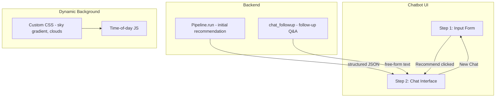

# SolarInvest Chatbot UX and Multi-Turn Overhaul

## Architecture Overview




---

## 1. Dynamic Background (iPhone Weather Style)

**Approach:** Custom CSS + minimal JavaScript for time-of-day. Gradio supports `css=` and `head=` in `gr.Blocks` / `launch()`.

**New file:** `[static/solarinvest.css](static/solarinvest.css)`

- **Sky gradient:** Animated `linear-gradient` that shifts based on time-of-day (dawn, day, dusk, night) using CSS variables set by JS
- **Cloud layer:** 2–3 floating cloud divs with `@keyframes` animation (translateX, opacity)
- **Sun/moon:** Optional circular element whose position/opacity changes by hour
- **Glassmorphism:** `backdrop-filter: blur()`, semi-transparent panels for input form and chat cards
- **Skeuomorphism:** Subtle shadows, rounded corners on chat bubbles

**New file:** `[static/solarinvest.js](static/solarinvest.js)`

- On load: get `new Date().getHours()`, map to time-of-day class (e.g. `dawn`, `day`, `dusk`, `night`)
- Inject a wrapper or set `data-time` on `.gradio-container` for CSS selectors
- Update gradient colors via `:root` CSS variables

**Integration:** Pass `css=Path("static/solarinvest.css")` and `head=<script src="...">` (or inline JS) to `gr.Blocks` / `app.launch()`.

---

## 2. Two-Step UI Flow

**Step 1 — Input form first (default view):**

- On app load: show only the input form (location, household, budget, etc.)
- Chat panel and follow-up input are **hidden** (`visible=False`)
- Layout: full-width or centered form with glassmorphism styling

**Step 2 — Chat appears after Recommend:**

- When "Recommend" is clicked:
  1. Validate inputs (existing logic)
  2. Run pipeline (existing `run_pipeline`)
  3. Use `gr.update(visible=True)` to show: chat panel, full report accordion, follow-up textbox, New Chat button
  4. Populate chat: user message (formatted inputs) + assistant message (recommendation summary)

**Implementation in** `[chatbot.py](chatbot.py)`:

- Use `gr.State` to hold: `session_data` (user_inputs, recommendation dict, full_report) for follow-up
- Two `gr.Group` (or Column) blocks: `input_form_group` (always visible initially), `chat_group` (visible=False initially)
- `submit_btn.click` returns `gr.update(visible=True)` for `chat_group` plus updated chat history

---

## 3. New Chat Button and Download

**Behavior:**

- **Option A — Download then New Chat:** Download current chat as file (e.g. `.md` or `.txt`), then clear chat and return to Step 1
- **Option B — New Chat without download:** Clear chat and return to Step 1 immediately

**Implementation:**

- Add "New Chat" button that opens a small `gr.Row` or `gr.Accordion` with two sub-buttons:
  - "Download and Start New Chat"
  - "Start New Chat"
- **Download:** Use `gr.DownloadButton` with a function that builds markdown/text from `chat_history` and returns a file path or bytes
- **Clear:** Return `gr.update(visible=False)` for `chat_group`, `gr.update(value=[])` for chatbot, reset `session_data` State, optionally `gr.update(visible=True)` for input form if it was hidden

**Chat export format:** Markdown with `## User` / `## SolarInvest Agent` sections, or plain text.

---

## 4. Follow-Up Questions (Multi-Turn)

**When chat is visible and user has not clicked New Chat:**

- Show a text input: "Ask a follow-up question (e.g. explain payback, compare options)"
- User submits → backend `chat_followup` → append assistant response to chat

**Backend changes (non-breaking):**

**A. Extend** `[backends/base.py](backends/base.py)`:

- Add optional abstract method `chat(messages: List[Dict[str, str]], max_tokens, temperature) -> str` (or implement with default that builds single prompt from messages)

**B. Extend** `[grok_backend.py](grok_backend.py)`:

- Add `chat(self, messages, max_tokens, temperature) -> str`
- Uses same `_call_sdk` / `_call_requests` but **without** `response_format` (no structured JSON)
- Messages format: `[{"role": "system", "content": "..."}, {"role": "user", "content": "..."}, {"role": "assistant", "content": "..."}, ...]`

**C. New module** `[chat_followup.py](chat_followup.py)` (or add to pipeline):

- `answer_followup(chat_history: List[gr.ChatMessage], user_question: str, session_data: dict) -> str`
- Builds messages:
  - System: "You are SolarInvest Agent. Answer the user's question based ONLY on the recommendation and conversation below. Do not invent numbers or facts. If the answer is not in the context, say so."
  - User/Assistant alternating from `chat_history` (convert `gr.ChatMessage` to `{role, content}`)
  - Append user's new question
- Calls `backend.chat(messages, ...)` and returns raw text

**D. Pipeline:**

- Add `chat_followup` method to `[pipeline.py](pipeline.py)` that:
  - Accepts `conversation_messages: List[Dict]`, `user_question: str`
  - Uses `_get_backend().chat(...)` with no structured output
  - Returns `{"response": str}`

**Existing `Pipeline.run()` remains unchanged.**

---

## 5. File Changes Summary


| File                     | Action                                                                                                             |
| ------------------------ | ------------------------------------------------------------------------------------------------------------------ |
| `static/solarinvest.css` | **Create** — sky gradient, clouds, glassmorphism, time-of-day variables                                            |
| `static/solarinvest.js`  | **Create** — set time-of-day class/vars on container                                                               |
| `chatbot.py`             | **Rewrite** — two-step flow, conditional visibility, New Chat + Download, follow-up input, wire to `chat_followup` |
| `backends/base.py`       | **Extend** — add `chat(messages, ...)` (optional/overridable)                                                      |
| `grok_backend.py`        | **Extend** — implement `chat()` without structured output                                                          |
| `pipeline.py`            | **Extend** — add `chat_followup(conversation_messages, user_question)`                                             |
| `config.yaml`            | **Optional** — add `followup_system_prompt` for SolarInvest Agent persona                                          |


---

## 6. Key Implementation Details

**Chat history format for backend:**

```python
# From Gradio: [gr.ChatMessage(role="user", content="..."), gr.ChatMessage(role="assistant", content="..."), ...]
# Convert to: [{"role": "user", "content": "..."}, {"role": "assistant", "content": "..."}, ...]
```

**Follow-up system prompt (anti-hallucination):**

```
You are SolarInvest Agent. Answer the user's follow-up question based ONLY on the solar recommendation and conversation provided below. Do not invent numbers, costs, or facts. If the answer is not in the context, say "I don't have that information in the recommendation." Be concise and helpful.
```

**Gradio component IDs:** Use `elem_id` for reliable CSS targeting (e.g. `#solarinvest-chat-panel`, `#solarinvest-input-form`).

---

## 7. Risks and Mitigations

- **Gradio DOM changes:** Custom CSS selectors may break across versions. Use `elem_id` and `elem_classes` for stability.
- **Background performance:** Keep animations lightweight (CSS only where possible) to avoid jank on low-end devices.
- **Follow-up token limits:** Long conversations may exceed context. Consider truncating oldest messages or summarizing if needed (future enhancement).

